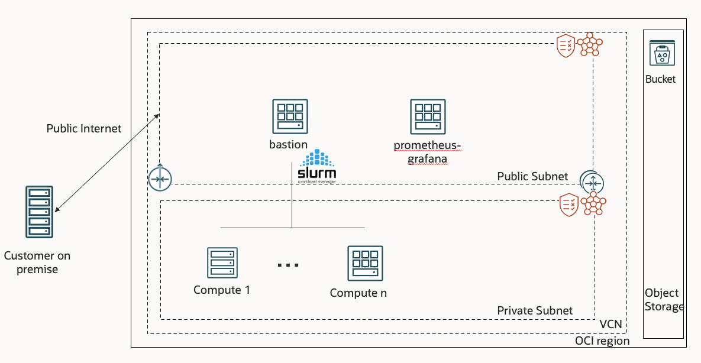

# Ansible roles to configure Prometheus.

This repo proposes a monitoring setup to complete the existing Oracle Stack "oci-hpc" https://github.com/oracle-quickstart/oci-hpc

## Architecture

It is assumed a OCI HPC Stack is deployed beforehand and another VM with Oracle Linux 8 isdeployed in the same subnet. This new VM will be the server of Grafana/Prometheus.

Notation:
- The server with Grafana/Prometheus is called "prometheus-grafana"
- The bastion deployed by the HPC stack is called "bastion"
- The future compute nodes to monitor are referred as "compute x"




Upon deployment via autoscaling, CPU and GPU metrics will be exported to Prometheus.
- CPU metrics are exported via https://github.com/prometheus/node_exporter running as a service on compute.
- GPU metrics are exported via https://docs.nvidia.com/datacenter/cloud-native/gpu-telemetry/dcgm-exporter.html running as a service in a docker container on compute. extra info on https://github.com/NVIDIA/dcgm-exporter


## Difference with the HPC stack for GPU monitoring

This setup has been tested on Oracle Linux 8 only. At the time of the tests (May 2023), the ansible roles "nvidia-container" and "docker" did not support Oracle Linux 8. Therefore, if you plan on monitoring GPU machines, it is recommended to replace the original "nvidia-container" and "docker" from the HPC stack by the ones of this repo on "bastion" in /opt/oci-hpc/playbooks/roles/

In order to monitor GPU machines, one must activate the "enroot" option in the HPC stack. Because this is activated globally by default, one can edit /opt/oci-hpc/playbooks/new_nodes.yml on "bastion" so that the roles "docker", "nvidia-container" and "nvidia-enroot" are executed only when "compute" is a GPU instance:
```
- hosts: compute
  become: true
  vars:
    enroot_top_path: "{{ nvme_path }}/enroot/"
  tasks:
    - include_role:
        name: docker
      when: enroot|default(true)|bool and ('GPU' in shape)
    - include_role:
        name: nvidia-container
      when: enroot|default(true)|bool and ('GPU' in shape)
    - include_role:
        name: nvidia-enroot
      when: enroot|default(true)|bool and ('GPU' in shape)
    - include_role:
        name: tuned
```


## Setup

Because this set of roles is an addon to the existing HPC stack, some manipulations are required in order to have a working setup.


1. Allow ssh between "bastion" and "prometheus-grafana". To do so, share the private/public rsa keys generated on bastion (/home/opc/.ssh/) and add the public key in /home/opc/.ssh/authorized_keys on "prometheus-grafana" 

2. Updates are needed in /etc/hosts on both "bastion" and "prometheus-grafana" to know the ip/hostname.

3. The Ansible inventory on "bastion" needs an update. Change the original inventory in /etc/ansible/hosts and the inventory template in /opt/oci-hpc/autoscaling/tf_init/inventory.tpl. Add the following "monitoring_server" serciton:
```
[monitoring_server]
prometheus-grafana ansible_host=<ip> ansible_user=opc role=monitoring_server  
```  

4. On "bastion" in role etc-hosts, add line for monitoring_server in template /opt/oci-hpc/playbooks/roles/etc-hosts/templates/etc-hosts-bastion.j2
```
<IP> prometheus-grafana.public.cluster.oraclevcn.com prometheus-grafana
```

In /opt/oci-hpc/playbooks/roles/etc-hosts/tasks/common.yml, move /etc/hosts also on "monitoring_server" in addition to the backup slurm and login node
```
- name: move /etc/hosts on backup slurm and login node and monitoring_server
  become: true
  copy:
    dest: /etc/hosts
    src: /etc/hosts
    force: yes
  when: ( not destroy|bool ) and (('slurm_backup' in group_names) or ('login' in group_names) or ('monitoring_server' in group_names))
```

block to delete nodes when destroyed on "monitoring_server" at the end of the file
```
- name: remove cluster from etc-host on monitoring_server
  become: true
  blockinfile:
    dest: /etc/hosts
    marker: "# {mark} ANSIBLE MANAGED BLOCK {{ cluster_name }}"
    state: absent
  delegate_to: "{{ groups['monitoring_server'][0] }}"
  run_once: true
  when: destroy|bool and (groups['monitoring_server']|length > 0)|bool
```

5. On "bastion" /opt/oci-hpc/playbooks/new_nodes.yml, add category monitoring_server for role /etc/hosts 
```
- hosts: bastion,slurm_backup,login,compute,monitoring_server
  become: true
  vars:
    destroy: false
  gather_facts: true
  roles:
    - etc-hosts
```

6. At the end of /opt/oci-hpc/playbooks/new_nodes.yml, after the Slurm execution, add a block:
```
- hosts: compute, monitoring_server, bastion
  become: true
  vars:
    destroy: false
  gather_facts: true
  roles:
    - node_export
```

7. Copy the role "node_export" on "bastion" in /opt/oci-hpc/playbooks/roles/

8.  On "bastion" in /opt/oci-hpc/playbooks/new_nodes.yml add the following block at the end of the file:
```
- hosts: compute, monitoring_server, bastion
  become: true
  vars: 
    destroy: false  
  gather_facts: true
  roles: 
    - node_export 
```

9. On "bastion" in /opt/oci-hpc/playbooks/destroy.yml add the following block at the end of the file:

```
- hosts: bastion, monitoring_server, compute
  become: true
  vars:
    destroy: true
  gather_facts: true
  roles: 
    - node_export
```

## Installation of Prometheus and Grafana

You can copy the roles "grafana" and "prometheus" in /opt/oci-hpc/playbooks/roles/ and server_prometheus_grafana.yml in /opt/oci-hpc/playbooks. You can then execute the following comand from "bastion" to configure the "monitoring_server"
```
ansible-playbooks -i /etc/ansible/hosts /opt/oci-hpc/playbooks/server_prometheus_grafana.yml
```

## During Autoscaling

At this stage, the prometheus agent for CPU and GPU will be installed on the compute nodes during autoscaling. On the monitoring_server, the list of nodes to monitor will be updated based on the information from Slurm.

## Monitoring in Prometheus

It is possible to access the Prometheus web portal from the monitoring_server on port 9090.
```
<monitoring_server public_ip>:9090
```

## Monitoring in Grafana

You can take Grafana dashboards from teh community in order to monitor your resources. You can access the Grafana web page from your browser:
```
<monitoring_server public_ip>:3000
```

1. Add "Prometheus" as Data Source on URL: http://localhost:9090

2. Here are examples Dashboards from the community for the CPU monitoring that you can import based on their ID

- ID: 11757. A simplified dashboard that monitors CPU/Memory/Network and also indicates traffic over RDMA https://grafana.com/grafana/dashboards/11757-hpc-node-exporter-server-simple-metrics-v2/
- ID: 1860. A complete overview of the node. https://grafana.com/grafana/dashboards/1860-node-exporter-full/
- ID: 12239 . Official Grafana dashboard from NVIDIA for DCGM export. https://grafana.com/grafana/dashboards/12239-nvidia-dcgm-exporter-dashboard/


## Additional resources for testing:

- "GPU burn", an easy setup from https://lambdalabs.com/blog/perform-gpu-and-cpu-stress-testing-on-linux to stress your GPU's

- "stress-ng", to stress your CPU's
```
sudo dnf install https://dl.fedoraproject.org/pub/epel/epel-release-latest-8.noarch.rpm -y
sudo dnf upgrade
sudo dnf install stress-ng

stress-ng --mq 0 -t 60s --times --perf
```

- "latency_bandwidth.sh", a home made script to test RDMA connexion using perftest. It can be executed from the bastion.
```
chmod a+x latency_bandwidth.sh
./latency_bandwidth.sh
```
It takes the IP's from /etc/hosts by default. In case you have non RDMA shape, you can specify the ip's in the file line 13 
hosts=(host1 host2 host3)
