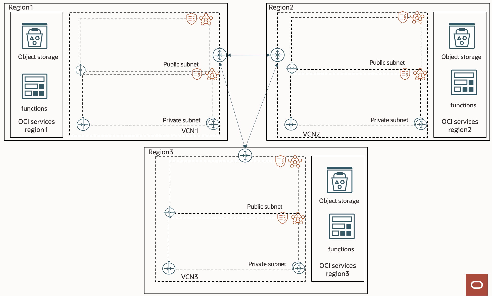

# Stack to create a Remote Peering between Oracle Cloud Infrastructure OCI Regions. 





## Acknowledments

This stack takes https://github.com/cpauliat/my-terraform-oci-examples/tree/master/13_OCI_demo_vcn_peering_remote as a baseline.

Additionally, it follows the recommendations from https://medium.com/oracledevs/how-to-securely-connect-cross-regional-oci-services-via-the-service-gateway-61646b470a20


## Policies to deploy the stack: 
```
allow service compute_management to use tag-namespace in tenancy
allow service compute_management to manage compute-management-family in tenancy
allow service compute_management to read app-catalog-listing in tenancy
allow group user to manage all-resources in compartment compartmentName
```

## Expected behaviour

This stack creates a Remote Peering between 2 OCI Regions. After execution, Region 1 and Region 2 have one Virtual Cloud Network (VCN) each. Each VCN contains the following:

    2 Subnets (public and private)
    1 Internet Gateway
    1 Nat Gateway
    1 Service Gateway
    1 Dynamic Routing Gateway (DRG) attachement

Additionally, it is possible to use the OCI Services from Region 2 in Region 1 and vice versa even if the NAT traffic is blocked (only Service Gateway and DRG active). This includes also access to Object Storage in both regions.

## 3rd region

It is also possible to peer a third region by setting "Add Region 3" to true.
This will deploy another VCN in another region with the same network capability as the two others. The peering will be all to all, there for an instance in one region can access the Oracle Services of the three regions.

## Sample code

As a test, you can deploy 1 VM's in the private subnet of each region (a jump VM in a public subnet might be required). From VM1, try to ping the private ip of VM2.

To check if a VM in Region 1 (VM_1) can reach Oracle Services of Region 2, you can upload an object in a bucket from Region 2. On VM_1, install oci-cli (https://docs.oracle.com/en-us/iaas/Content/API/SDKDocs/cliinstall.htm). To make sure the traffic passes via the Oracle Backbone, block the Nat traffic of region 1 and region 2. From VM_1 in region 1, run the following command:
```console
oci os object get -bn <Bucket_Region2> --name <Test_Object_Region2> --file <test_file> --auth instance_principal --region <region2>
```