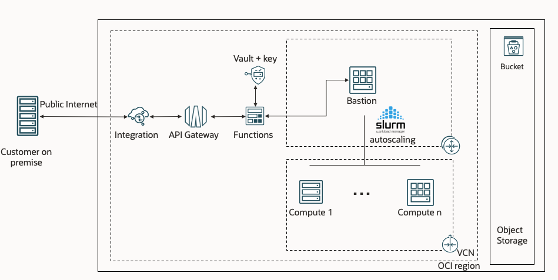

# Stack to create an HPC cluster. 

[](https://cloud.oracle.com/resourcemanager/stacks/create?zipUrl=https://github.com/oracle-quickstart/oci-hpc/archive/refs/heads/master.zip)


## Policies to deploy the stack: 
```
allow service compute_management to use tag-namespace in tenancy
allow service compute_management to manage compute-management-family in tenancy
allow service compute_management to read app-catalog-listing in tenancy
allow group user to manage all-resources in compartment compartmentName
```
## Policies for autoscaling or resizing:
As described when you specify your variables, if you select instance-principal as way of authenticating your node, make sure your generate a dynamic group and give the following policies to it: 
```
Allow dynamic-group instance_principal to read app-catalog-listing in tenancy
Allow dynamic-group instance_principal to use tag-namespace in tenancy
```
And also either:

```
Allow dynamic-group instance_principal to manage compute-management-family in compartment compartmentName
Allow dynamic-group instance_principal to manage instance-family in compartment compartmentName
Allow dynamic-group instance_principal to use virtual-network-family in compartment compartmentName
Allow dynamic-group instance_principal to use volumes in compartment compartmentName
```
or:

`Allow dynamic-group instance_principal to manage all-resources in compartment compartmentName`


## Supported OS: 
The stack allowa various combination of OS. Here is a list of what has been tested. We can't guarantee any of the other combination.

|     Bastion   |    Compute   |
|---------------|--------------|
|      OL7      |      OL7     |  
|      OL7      |      OL8     |
|      OL7      |    CentOS7   |
| Ubuntu  20.04 | Ubuntu 20.04 |

When switching to Ubuntu, make sure the username is changed from opc to Ubuntu in the ORM for both the bastion and compute nodes. 
## How is resizing different from autoscaling ?
Autoscaling is the idea of launching new clusters for jobs in the queue. 
Resizing a cluster is changing the size of a cluster. In some case growing your cluster may be a better idea, be aware that this may lead to capacity errors. Because Oracle CLoud RDMA is non virtualized, you get much better performance but it also means that we had to build HPC islands and split our capacity across different network blocks.
So while there may be capacity available in the DC, you may not be able to grow your current cluster.  

# Cluster Network Resizing (via resize.sh)

Cluster resizing refers to ability to add or remove nodes from an existing cluster network. Apart from add/remove, the resize.py script can also be used to reconfigure the nodes. 

Resizing of HPC cluster with Cluster Network consist of 2 major sub-steps:
- Add/Remove node (IaaS provisioning) to cluster – uses OCI Python SDK 
- Configure the nodes (uses Ansible)
  -  Configures newly added nodes to be ready to run the jobs
  -  Reconfigure services like Slurm to recognize new nodes on all nodes
  -  Update rest of the nodes, when any node/s are removed (eg: Slurm config, /etc/hosts, etc.)

  Cluster created by the autoscaling script can also be resized by using the flag --cluster_name cluster-1-hpc
 
## resize.sh usage 

The resize.sh is deployed on the bastion node as part of the HPC cluster Stack deployment. Unreachable nodes have been causing issues. If nodes in the inventory are unreachable, we will not do cluster modification to the cluster unless --remove_unreachable is also specified. That will terminate the unreachable nodes before running the action that was requested (Example Adding a node) 

```
/opt/oci-hpc/bin/resize.sh -h
usage: resize.sh [-h] [--compartment_ocid COMPARTMENT_OCID]
                 [--cluster_name CLUSTER_NAME] [--nodes NODES [NODES ...]]
                 [--no_reconfigure] [--user_logging] [--force] [--remove_unreachable]
                 [{add,remove,list,reconfigure}] [number]

Script to resize the CN

positional arguments:
  {add,remove,remove_unreachable,list,reconfigure}
                        Mode type. add/remove node options, implicitly
                        configures newly added nodes. Also implicitly
                        reconfigure/restart services like Slurm to recognize
                        new nodes. Similarly for remove option, terminates
                        nodes and implicitly reconfigure/restart services like
                        Slurm on rest of the cluster nodes to remove reference
                        to deleted nodes.
  number                Number of nodes to add or delete if a list of
                        hostnames is not defined

optional arguments:
  -h, --help            show this help message and exit
  --compartment_ocid COMPARTMENT_OCID
                        OCID of the compartment, defaults to the Compartment
                        OCID of the localhost
  --cluster_name CLUSTER_NAME
                        Name of the cluster to resize. Defaults to the name
                        included in the bastion
  --nodes NODES [NODES ...]
                        List of nodes to delete
  --no_reconfigure      If present. Does not rerun the playbooks
  --user_logging        If present. Use the default settings in ~/.oci/config
                        to connect to the API. Default is using
                        instance_principal
  --force               If present. Nodes will be removed even if the destroy
                        playbook failed
  --ansible_crucial     If present during reconfiguration, only crucial
                        ansible playbooks will be executed on the live nodes.
                        Non live nodes will be removed
  --remove_unreachable  If present, nodes that are not sshable will be removed
                        from the config. They will however not be removed from
                        Slurm to avoid losing track of the down nodes. If you
                        need to remove them from Slurm after terminating the
                        nodes in the console. Run sudo scontrol update
                        nodename=name state=Future 
```

**Add nodes** 

Consist of the following sub-steps:
- Add node (IaaS provisioning) to cluster – uses OCI Python SDK 
- Configure the nodes (uses Ansible)
  -  Configures newly added nodes to be ready to run the jobs
  -  Reconfigure services like Slurm to recognize new nodes on all nodes

Add one node 
```
/opt/oci-hpc/bin/resize.sh add 1

```

Add three nodes to cluster compute-1-hpc
```
/opt/oci-hpc/bin/resize.sh add 3 --cluster_name compute-1-hpc

```


**Remove nodes** 

Consist of the following sub-steps:
- Remove node/s (IaaS termination) from cluster – uses OCI Python SDK 
- Reconfigure rest of the nodes in the cluster  (uses Ansible)
  -  Remove reference to removed node/s on rest of the nodes (eg: update /etc/hosts, slurm configs, etc.)
 

Remove specific node:  
```
/opt/oci-hpc/bin/resize.sh remove --nodes inst-dpi8e-assuring-woodcock
```
or 

Remove a list of nodes (space seperated):  
```
/opt/oci-hpc/bin/resize.sh remove --nodes inst-dpi8e-assuring-woodcock inst-ed5yh-assuring-woodcock
```
or 
Remove one node randomly:  
```
/opt/oci-hpc/bin/resize.sh remove 1
```
or 
Remove 3 nodes randomly from compute-1-hpc:  
```
/opt/oci-hpc/bin/resize.sh remove 3 --cluster_name compute-1-hpc

```

**Reconfigure nodes** 

This allows users to reconfigure nodes (Ansible tasks) of the cluster.  

Full reconfiguration of all nodes of the cluster.   This will run the same steps, which are ran when a new cluster is created.   If you manually updated configs which are created/updated as part of cluster configuration, then this command will overwrite your manual changes.   

```
/opt/oci-hpc/bin/resize.sh reconfigure
```


## Resizing (via OCI console)
**Things to consider:**  
- If you resize from OCI console to reduce cluster network/instance pool size(scale down),  the OCI platform decides which node to terminate (oldest node first)
- OCI console only resizes the Cluster Network/Instance Pool, but it doesn't execute the ansible tasks (HPC Cluster Stack) required to configure the newly added nodes or to update the existing nodes when a node is removed (eg: updating /etc/hosts, slurm config, etc).   


# Autoscaling

The autoscaling will work in a “cluster per job” approach. This means that for job waiting in the queue, we will launch new cluster specifically for that job. Autoscaling will also take care of spinning down clusters. By default, a cluster is left Idle for 10 minutes before shutting down. Autoscaling is achieved with a cronjob to be able to quickly switch from one scheduler to the next.

Smaller jobs can run on large clusters and the clusters will be resized down after the grace period to only the running nodes. Cluster will NOT be resized up. We will spin up a new larger cluster and spin down the smaller cluster to avoid capacity issues in the HPC island. 

Initial cluster deployed through the stack will never be spun down.

There is a configuration file at `/opt/oci-hpc/conf/queues.conf` with an example at `/opt/oci-hpc/conf/queues.conf.example`to show how to add multiple queues and multiple instance types. Examples are included for HPC, GPU or Flex VMs. 

You will be able to use the instance type name as a feature in the job definition to make sure it runs/create the right kind of node. 

You can only have one default instance-type per queue and one default queue. To submit to a non default queue, either add this line to the SBATCH file: `#SBATCH --partition compute` or in the command line: `sbatch -p queuename job.sh`

The key word `permanent` allows will spin up clusters but not delete them untill it is set to false. It is not needed to reconfigure slurm after you change that value. 

After a modification of the `/opt/oci-hpc/conf/queues.conf`, you need to run 
`/opt/oci-hpc/bin/slurm_config.sh`

If you have some state that is messing with Slurm, you can make sure it is put back in the initial state with 
`/opt/oci-hpc/bin/slurm_config.sh --initial`

To turn on autoscaling: 
Uncomment the line in `crontab -e`:
```
* * * * * /opt/oci-hpc/autoscaling/crontab/autoscale_slurm.sh >> /opt/oci-hpc/logs/crontab_slurm.log 2>&1
```

# Submit
How to submit jobs: 
Slurm jobs can be submitted as always but a few more constraints can be set: 
Example in `/opt/oci-hpc/samples/submit/`: 

```
#!/bin/sh
#SBATCH -n 72
#SBATCH --ntasks-per-node 36
#SBATCH --exclusive
#SBATCH --job-name sleep_job
#SBATCH --constraint hpc-default

cd /nfs/scratch
mkdir $SLURM_JOB_ID
cd $SLURM_JOB_ID
MACHINEFILE="hostfile"

# Generate Machinefile for mpi such that hosts are in the same
#  order as if run via srun
#
scontrol show hostnames $SLURM_JOB_NODELIST > $MACHINEFILE
sed -i "s/$/:${SLURM_NTASKS_PER_NODE}/" $MACHINEFILE

cat $MACHINEFILE
# Run using generated Machine file:
sleep 1000
```
 
- Instance Type: You can specify the OCI instance type that you’d like to run on as a constraint. This will make sure that you run on the right shape and also generate the right cluster. Instance types are defined in the `/opt/oci-hpc/conf/queues.conf` file in yml format. Leave all of the field in there even if they are not used. You can define multiple queues and multiple instance type in each queue. If you do not select an instance type when creating your job, it will use the default one.

## Clusters folders: 
```
/opt/oci-hpc/autoscaling/clusters/clustername
```

## Logs: 
```
/opt/oci-hpc/logs
```

Each cluster will have his own log with name: `create_clustername_date.log` and `delete_clustername_date.log`
The log of the crontab will be in `crontab_slurm.log`


## Manual clusters: 
You can create and delete your clusters manually. 
### Cluster Creation
```
/opt/oci-hpc/bin/create_cluster.sh NodeNumber clustername instance_type queue_name
```
Example: 
```
/opt/oci-hpc/bin/create_cluster.sh 4 compute2-1-hpc HPC_instance compute2
```
The name of the cluster must be
queueName-clusterNumber-instanceType_keyword

The keyword will need to match the one from /opt/oci-hpc/conf/queues.conf to be registered in Slurm

### Cluster Deletion: 
```
/opt/oci-hpc/bin/delete_cluster.sh clustername
```

In case something goes wrong during the deletion, you can force the deletion with 
```
/opt/oci-hpc/bin/delete_cluster.sh clustername FORCE
```
When the cluster is already being destroyed, it will have a file `/opt/oci-hpc/autoscaling/clusters/clustername/currently_destroying` 

## Autoscaling Monitoring
If you selected the autoscaling monitoring, you can see what nodes are spinning up and down as well as running and queued jobs. Everything will run automatically except the import of the Dashboard in Grafana due to a problem in the Grafana API. 

To do it manually, in your browser of choice, navigate to bastionIP:3000. Username and password are admin/admin, you can change those during your first login. Go to Configuration -> Data Sources. Select autoscaling. Enter Password as Monitor1234! and click on 'Save & test'. Now click on the + sign on the left menu bar and select import. Click on Upload JSON file and upload the file the is located at `/opt/oci-hpc/playbooks/roles/autoscaling_mon/files/dashboard.json`. Select autoscaling (MySQL) as your datasource. 

You will now see the dashboard. 


# LDAP 
If selected bastion host will act as an LDAP server for the cluster. It's strongly recommended to leave default, shared home directory. 
User management can be performed from the bastion using ``` cluster ``` command. 
Example of cluster command to add a new user: 
```cluster user add name```
By default, a `privilege` group is created that has access to the NFS and can have sudo access on all nodes (Defined at the stack creation. This group has ID 9876) The group name can be modified.
```cluster user add name --gid 9876```
To avoid generating a user-specific key for passwordless ssh between nodes, use --nossh. 
```cluster user add name --nossh --gid 9876```

# Shared home folder

By default, the home folder is NFS shared directory between all nodes from the bastion. You have the possibility to use a FSS to share it as well to keep working if the bastion goes down. You can either create the FSS from the GUI. Be aware that it will get destroyed when you destroy the stack. Or you can pass an existing FSS IP and path. If you share an existing FSS, do not use /home as mountpoint. The stack will take care of creating a $nfsshare/home directory and mounting it at /home after copying all the appropriate files. 

# Deploy within a private subnet

If "true", this will create a private endpoint in order for Oracle Resource Manager to configure the bastion VM and the future nodes in private subnet(s). 
* If "Use Existing Subnet" is false, Terraform will create 2 private subnets, one for the bastion and one for the compute nodes.  
* If "Use Existing Subnet" is also true, the user must indicate a private subnet for the bastion VM. For the compute nodes, they can reside in another private subnet or the same private subent as the bastion VM. 

The bastion VM will reside in a private subnet. Therefore, the creation of a "bastion service" (https://docs.oracle.com/en-us/iaas/Content/Bastion/Concepts/bastionoverview.htm), a VPN or FastConnect connection is required. If a public subnet exists in the VCN, adapting the security lists and creating a jump host can also work. Finally, a Peering can also be established betwen the private subnet and another VCN reachable by the user.


## max_nodes_partition.py usage 

Use the alias "max_nodes" to run the python script max_nodes_partition.py. You can run this script only from bastion.

$ max_nodes --> Information about all the partitions and their respective clusters, and maximum number of nodes distributed evenly per partition

$ max_nodes --include_cluster_names xxx yyy zzz --> where xxx, yyy, zzz are cluster names. Provide a space separated list of cluster names to be considered for displaying the information about clusters and maximum number of nodes distributed evenly per partition


## validation.py usage

Use the alias "validate" to run the python script validation.py. You can run this script only from bastion. 

The script performs these checks. 
-> Check the number of nodes is consistent across resize, /etc/hosts, slurm, topology.conf, OCI console, inventory files.
-> PCIe bandwidth check 
-> GPU Throttle check 
-> Check whether md5 sum of /etc/hosts file on nodes matches that on bastion

Provide at least one argument: [-n NUM_NODES] [-p PCIE] [-g GPU_THROTTLE] [-e ETC_HOSTS]

Optional argument with [-n NUM_NODES] [-p PCIE] [-g GPU_THROTTLE] [-e ETC_HOSTS]: [-cn CLUSTER_NAMES]
Provide a file that lists each cluster on a separate line for which you want to validate the number of nodes and/or pcie check and/or gpu throttle check and/or /etc/hosts md5 sum. 

For pcie, gpu throttle, and /etc/hosts md5 sum check, you can either provide y or Y along with -cn or you can give the hostfile path (each host on a separate line) for each argument. For number of nodes check, either provide y or give y along with -cn.

Below are some examples for running this script.

validate -n y --> This will validate that the number of nodes is consistent across resize, /etc/hosts, slurm, topology.conf, OCI console, inventory files. The clusters considered will be the default cluster if any and cluster(s) found in /opt/oci-hpc/autoscaling/clusters directory. The number of nodes considered will be from the resize script using the clusters we got before. 

validate -n y -cn <cluster name file> --> This will validate that the number of nodes is consistent across resize, /etc/hosts, slurm, topology.conf, OCI console, inventory files. It will also check whether md5 sum of /etc/hosts file on all nodes matches that on bastion. The clusters considered will be from the file specified by -cn option. The number of nodes considered will be from the resize script using the clusters from the file. 

validate -p y -cn <cluster name file> --> This will run the pcie bandwidth check. The clusters considered will be from the file specified by -cn option. The number of nodes considered will be from the resize script using the clusters from the file. 

validate -p <pcie host file> --> This will run the pcie bandwidth check on the hosts provided in the file given. The pcie host file should have a host name on each line.

validate -g y -cn <cluster name file> --> This will run the GPU throttle check. The clusters considered will be from the file specified by -cn option. The number of nodes considered will be from the resize script using the clusters from the file. 

validate -g <gpu check host file> --> This will run the GPU throttle check on the hosts provided in the file given. The gpu check host file should have a host name on each line.

validate -e y -cn <cluster name file> --> This will run the /etc/hosts md5 sum check. The clusters considered will be from the file specified by -cn option. The number of nodes considered will be from the resize script using the clusters from the file. 

validate -e <md5 sum check host file> --> This will run the /etc/hosts md5 sum check on the hosts provided in the file given. The md5 sum check host file should have a host name on each line.

You can combine all the options together such as:
validate -n y -p y -g y -e y -cn <cluster name file>

# Slurm Submission Web Portal
It is possible to deploy a web submission portal by checking "_Slurm web submission portal_". This provides a web application developped in Visual Builder from where the user can upload a submission file to submit a job to Slurm, cancel a job, check the queue of Slurm and see the log of a complete job. This can serve as a frontend for non expert users who do not wish to interact with a terminal window. This is not intended to replace a system administrator as configuration, monitoring and fine-tuning are always necessary on the Bastion.

Here is an overview of the default architecture diagram when "_Slurm web submission portal_" is set to "_true_"



The frontend makes API calls to an endpoint on an API gateway. This API Gateway will then execute a set of serverless functions depending on the required action (list the jobs, submit a job, cancel a job, get the available features in the current Slurm configuration). All the actions start by fetching a ssh key stored as an OCI Secret in an OCI Vault in order to ssh to the bastion and send the remote Slurm command (sacct, sinfo, scancel, sbatch...). The response is sent back to the frontend.

The submission file must be a bash script without Slurm options (i.e. #SBATCH -n X). The Slurm Web Portal takes care of setting those. Here is a sample script with the expected syntax for a PingPong on BM.Optimized3.36:

```
#!/bin/sh
cd /nfs/scratch
mkdir $SLURM_JOB_ID
cd $SLURM_JOB_ID
MACHINEFILE="hostfile"
scontrol show hostnames $SLURM_JOB_NODELIST > $MACHINEFILE
hosts=""
for i in `cat $MACHINEFILE | awk '{print $1}'`; do hosts=$hosts:$i ;done
hosts=${hosts#?};
hosts=`tr ':' ' ' <<<"$hosts"`
hosts=($hosts)

export MPI_FLAGS="-mca pml ucx -x UCX_NET_DEVICES=mlx5_2:1 -x UCX_IB_TRAFFIC_CLASS=105 -x UCX_IB_GID_INDEX=3 -x HCOLL_ENABLE_MCAST_ALL=0 -x coll_hcoll_enable=0 --cpu-set 0,1,2,3,4,5,6,7,8,9,10,11,12,13,14,15,16,17,18,19,20,21,22,23,24,25,26,27,28,29,30,31,32,33,34,35"
source `ls /usr/mpi/gcc/openmpi-*/bin/mpivars.sh`

for (( i=0; i<${#hosts[@]}; i++ ));
do
    for (( j=$i; j<${#hosts[@]}; j++ ));
    do
        echo "******    running on ${hosts[$i]} ${hosts[$j]}    ******"
        mpirun ${MPI_FLAGS} -np 2 --host ${hosts[$i]},${hosts[$j]} /usr/mpi/gcc/openmpi-*/tests/imb/IMB-MPI1 pingpong
    done
done
```


## Prerequisites and considerations
This section adresses policies and dynamic group that must be set in order for the deployment to be successful. It also addresses limit considerations on the additional resources that will be deployed. 

### Policies and Dynamic Group
Statements must be added in a dynamic group for the functions and API gateway to operate correctly. Here, we take the example of a Dynamic Group called "DG_HPC" controlling resources deployed in compartment "HPC_COMP" with OCID:"ocid1.compartment.oc1..aaaXXXX"

```
ALL {resource.type = 'fnfunc', resource.compartment.id = 'ocid1.compartment.oc1..aaaXXXX'}
ALL {resource.type = 'ApiGateway', resource.compartment.id = 'ocid1.compartment.oc1..aaaXXXX'}
```

The next step consists in creating a Policy at the root level giving rights to this Dynamic Group. In our case:
```
allow dynamic-group DG_HPC to manage all-resources in compartment HPC_COMP
```

### Limits considerations
As always, make sure you have the correct limits prior to deploying. Here is what will be created by the stack in case you do not choose to reuse existing resources:

* 1 Public API Gateway
* 1 deployment in this API gateway
* 1 Vault
* 1 Master Encryption Key
* 1 Secret within the Vault
* 1 Container Registry
* 1 Application
* 1 Serverless Function within this Application
* 1 Bucket in Object Sorage (in case "_Build Application_" is checked)
* 1 Auth Token

Because resources in identity and security (vault, master key, secret) are not deleted on the spot but within a period up to 1 month, you can quickly reach your limits in case of multiple deployment/destruction.

This serverless deployment takes advantage of functions called within containers. A phenomenon of [Cold Start](https://docs.oracle.com/en-us/iaas/Content/Functions/Tasks/functionsusingprovisionedconcurrency.htm) may happen on the first call or after a period of inactivity.

## Options
* _Slurm web submission portal_ : If _true_, will deploy all the resources to build teh Slurm Web Application.
* _Use existing auth token_ : If _true_, will use an existing Auth Token. Will be created otherwise. **WARNING**: if a region different from the "Home Region" is used, the creation of the auth token will fail. Please create your Auth Token in your home region prior to deploying the stack and use "_Use existing auth token_"
* _Auth token_ : Visible only if _Use existing auth token_ is _true_. Auth Token as a string.
* _Use existing vault_ : If _true_, will use an existing Vault. Will be created otherwise.
* _OCID of existing vault_: Visible only if _Use existing vault_ is _true_. Vault to select within the compartment.
* _Use existing master key_ : If _true_, will use an existing Master Key in Vault. Will be created otherwise.
* _OCID of existing master key in vault_ : Visible only if _Use existing master key_ is _true_. Master Key to select within the Vault in the compartment.
* _Use existing API Gateway_ : If _true_, will use an existing API Gateway. Will be created otherwise.
* _OCID of existing API Gateway_ : Visible only if _Use existing API Gateway_ is _true_. OCID of existing API Gateway as a string.
* _Use existing registry_ : If _true_, will use an existing Registry. Will be created otherwise.
* _OCID of existing registry_ : Visible only if _Use existing registry_ is _true_. OCID of existing registry_ as a string.
* _Build Application_ : Build Application and deploy to a newly created Bucket in Object Storage.

## Outputs
There are several ways to acces to the Slurm Web Portal.

* Object Storage deployment: If you check _Build Application_, a pre-authenticated request (PAR) will be generated and visible in the Outputs. You can copy the URL and access it in a Web Browser.
* Deployment via Visual Builder: You can follow the indications from the output "Visual Builder" and copy the archive thanks to the output "_scp-command_"  
* Local Deployment: Finally, it is possible to deploy the application locally. You can run the scp command to copy the archive locally. You then need to build the application with th following commands:
  export OCI_PATH_CONF_FILE=/opt/oci-hpc/conf/queues.conf # default location of queues.conf 
  export OCI_USER=opc  # default username
  export OCI_SEARCHDATE=2023-05-24   # Change the date to the creation date
  export OCI_PUBLIC_IP=XXX.XXX.XXX.XX  # Public IP of the bastion
  export OCI_SECRET_OCID=ocid1.vaultsecret.oc1.XXXX.XXXXXXX   # Secret OCID
  export OCI_APIGWURL=https://XXXXna.apigateway.XXXX.oci.customer-oci.com/XXX  # Endpoint
  npm install
  ./node_modules/.bin/grunt initVar vb-process-local vb-package --mode=fa

